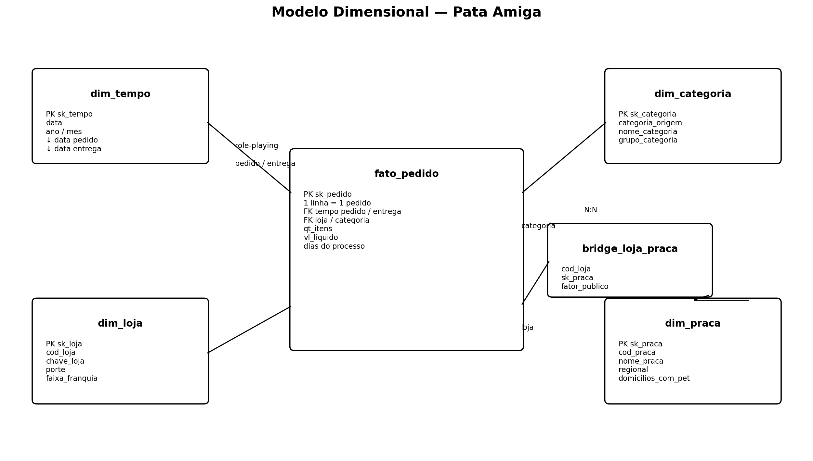
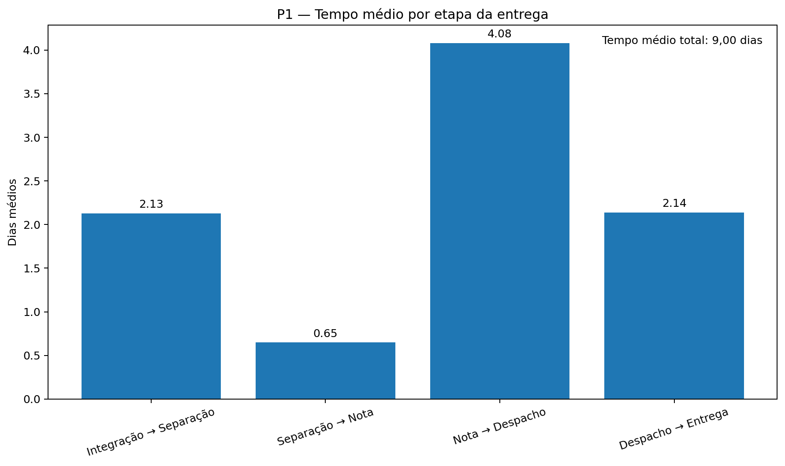
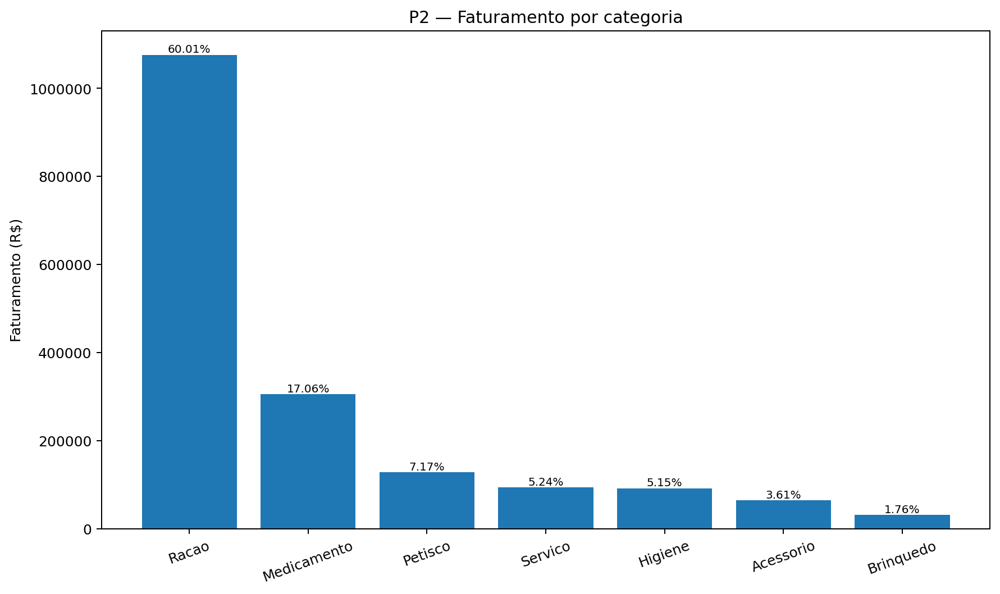
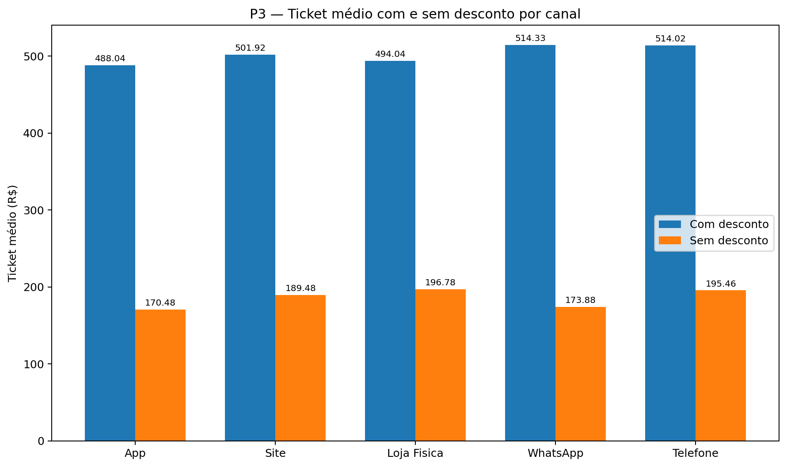
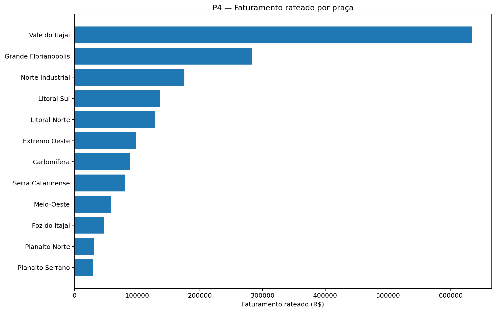
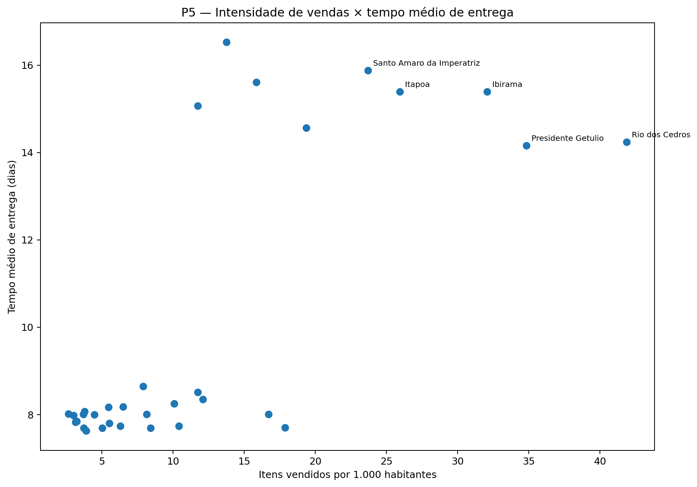

# 🐾 Mini Projeto Acadêmico — Data Warehouse Pata Amiga

## 1. Contextualização

A **Pata Amiga** é uma rede catarinense de pet shops fundada em Blumenau em 2009. Atualmente, a empresa possui 32 lojas distribuídas pelo estado de Santa Catarina.

Em setembro de 2023, a rede integrou sua operação de pedidos realizados por diferentes canais: App, Site, Telefone, WhatsApp e Loja Física.

Durante o período analisado, de setembro de 2023 a março de 2024, foram registrados **4.044 pedidos**.

Os dados necessários para análise estavam distribuídos em três fontes distintas:

- plataforma de pedidos e entregas;
- cadastro de lojas;
- cadastro das praças de atendimento.

Além disso, os dados apresentavam problemas de qualidade, como diferentes grafias para a mesma loja ou categoria, datas em formatos distintos, valores monetários armazenados como texto, campos vazios e pedidos sem código de loja.

O objetivo deste projeto foi construir um **modelo dimensional** capaz de integrar e tratar essas informações para responder cinco perguntas de negócio da Pata Amiga.

---

# 2. Objetivo do Projeto

O objetivo principal foi desenvolver um modelo dimensional que permitisse responder às seguintes perguntas:

1. Onde está o gargalo do processo de entrega?
2. Qual categoria concentra o faturamento?
3. O desconto funciona da mesma maneira em todos os canais?
4. Qual praça de atendimento concentra o faturamento?
5. Onde abrir a próxima loja e o que os dados não permitem afirmar?

O modelo foi desenvolvido no **PostgreSQL**, utilizando uma arquitetura dimensional com uma tabela fato, quatro dimensões e uma tabela ponte.

---

# 3. Estrutura das Bases de Origem

Foram disponibilizadas três tabelas de staging.

| Tabela | Descrição | Linhas |
|---|---|---:|
| `stg_pedido` | Pedidos e etapas do processo de entrega | 4.044 |
| `stg_loja` | Cadastro atual das lojas | 32 |
| `stg_loja_praca` | Relacionamento entre lojas e praças | 48 |

As tabelas de staging foram mantidas sem alterações. Todo o tratamento foi realizado durante a carga das dimensões e da tabela fato.

---

# 4. Diagnóstico da Origem

Antes da construção do modelo dimensional, foi realizada uma análise dos dados de origem.

Foram identificados:

- **4.044 pedidos**;
- **32 lojas**;
- **48 relacionamentos loja × praça**;
- **37 grafias distintas de categoria**;
- **1.575 pedidos sem código de loja preenchido**;
- **3 pedidos sem nome de loja**;
- **1.077 registros sem data de separação**;
- **1.338 registros sem data de nota fiscal**;
- **1.665 registros sem data de despacho**;
- **1.953 registros sem data de entrega**.

Também foram identificadas diversas variações de grafia nos nomes das lojas e categorias.

Exemplos:

```text
Pata Amiga Blumenau Centro
PATA AMIGA BLUMENAU CENTRO
PATA AMIGA BLUMENAL CENTRO
```

Outro problema encontrado foi a existência de valores numéricos e monetários armazenados como texto.

Exemplos:

```text
R$ 1.850,00
1850.00
1.200
-
```

Esses problemas exigiram tratamento antes da construção das análises.

---

# 5. Modelo Dimensional

O modelo desenvolvido utiliza o esquema estrela como estrutura principal.

A tabela central é:

```text
fato_pedido
```

O grão definido foi:

> **1 linha = 1 pedido**

A tabela fato possui exatamente **4.044 registros**.

As dimensões utilizadas são:

```text
dim_tempo
dim_loja
dim_categoria
dim_praca
```

Também foi criada a tabela ponte:

```text
bridge_loja_praca
```

## Diagrama



A estrutura lógica é:

```text
                    dim_tempo
                       │
                  pedido/entrega
                       │
                       ▼
dim_categoria ───► fato_pedido ◄─── dim_loja
                                      │
                                      ▼
                             bridge_loja_praca
                                      │
                                      ▼
                                  dim_praca
```

A `dim_tempo` é utilizada duas vezes pela fato:

- data do pedido;
- data da entrega.

Esse conceito é conhecido como **Role-Playing Dimension**.

---

# 6. Tratamento dos Dados

## 6.1 Datas

As datas dos pedidos e da integração com o ERP estavam no formato americano:

```text
MM/DD/YYYY HH12:MI AM
```

A conversão foi realizada com:

```sql
TO_TIMESTAMP(coluna, 'MM/DD/YYYY HH12:MI AM')
```

Os marcos do processo de entrega estavam no formato:

```text
YYYY-MM-DD
```

e foram convertidos utilizando:

```sql
coluna::date
```

---

## 6.2 Valores monetários

Valores monetários estavam armazenados em diferentes formatos.

Exemplos:

```text
R$ 1.850,00
1850.00
1.200
-
```

Os valores foram convertidos para:

```text
DECIMAL(15,2)
```

Valores vazios ou representados por `-` foram convertidos para:

```text
NULL
```

Um valor ausente não foi transformado em zero, pois zero representaria uma informação diferente de um dado inexistente.

---

# 7. Padronização das Categorias

A origem possuía **37 grafias diferentes de categorias**.

Foi criada a dimensão:

```text
dim_categoria
```

A grafia original foi preservada no atributo:

```text
categoria_origem
```

As categorias foram padronizadas para:

- Racao
- Medicamento
- Petisco
- Higiene
- Brinquedo
- Acessorio
- Servico
- Nao Informado

A ordem das regras de classificação foi importante.

Por exemplo:

```text
Ração Medicamentosa
```

precisa ser classificada como:

```text
Medicamento
```

e não como Racao.

Por isso, a regra referente a `MED` foi avaliada antes da regra referente a `RA`.

---

# 8. Padronização das Lojas

Os nomes das lojas apresentavam diferenças de:

- maiúsculas e minúsculas;
- acentuação;
- espaços;
- sufixos;
- abreviações;
- erros de digitação.

O processo de normalização incluiu:

1. remoção de espaços extras;
2. remoção do sufixo `/SC`;
3. remoção de acentos;
4. conversão para caixa alta;
5. tratamento manual das exceções conhecidas.

Foram tratadas especificamente grafias como:

```text
PATA AMIGA BLUMENAL CENTRO
→ PATA AMIGA BLUMENAU CENTRO

PATA AMIGA FLORIPA NORTE
→ PATA AMIGA FLORIANOPOLIS NORTE

PATA AMIGA JGUA DO SUL
→ PATA AMIGA JARAGUA DO SUL
```

Após o tratamento, somente **3 pedidos** permaneceram sem loja identificada.

Esses pedidos receberam:

```text
sk_loja = -1
```

evitando chaves estrangeiras nulas.

---

# 9. Padronização do Desconto

O campo referente ao desconto apresentava diferentes grafias.

Os valores foram padronizados para:

```text
Sim
Nao
Nao Informado
```

Exemplos classificados como `Sim`:

```text
S
SIM
1
X
TRUE
V
```

Exemplos classificados como `Nao`:

```text
N
NAO
0
FALSE
F
```

---

# 10. Padronização dos Canais

Os canais foram padronizados para:

```text
App
Site
Loja Fisica
Telefone
WhatsApp
Nao Informado
```

A ordem das regras também foi importante.

`WHATS` foi avaliado antes de `APP`, pois:

```text
WHATSAPP
```

também contém a sequência:

```text
APP
```

Após o tratamento, foram identificados **414 pedidos via WhatsApp**.

---

# 11. Construção da Tabela Fato

A tabela:

```text
fato_pedido
```

possui o grão:

> **1 linha = 1 pedido**

Após a carga foram obtidos:

```text
4.044 registros
```

As validações apresentaram:

| Validação | Resultado |
|---|---:|
| Registros na fato | **4.044** |
| FKs nulas | **0** |
| Pedidos sem loja identificada | **3** |
| Entregas não concluídas | **1.953** |
| Faturamento total | **R$ 1.793.308,51** |

---

# 12. P1 — Onde está o gargalo da entrega?

Foram analisados os quatro intervalos do processo:

```text
Integração → Separação
Separação → Nota
Nota → Despacho
Despacho → Entrega
```

O tempo médio total entre a integração no ERP e a entrega ao cliente ficou próximo de **9 dias**.

Entre os intervalos analisados, foram obtidos, entre outros:

| Etapa | Tempo médio |
|---|---:|
| Separação → Nota | **0,65 dia** |
| Nota → Despacho | **4,08 dias** |

O maior intervalo observado foi:

> **Nota Fiscal → Despacho**

com média de **4,08 dias**.

## Conclusão da P1

O principal gargalo do processo de entrega não está necessariamente no transporte final até o consumidor.

O maior tempo ocorre **entre a emissão da nota fiscal e o despacho para a transportadora**.

Portanto, essa etapa deve ser priorizada em uma investigação operacional.



---

# 13. P2 — Qual categoria concentra o faturamento?

O faturamento total analisado foi:

> **R$ 1.793.308,51**

A distribuição foi:

| Categoria | Faturamento | Participação |
|---|---:|---:|
| **Racao** | **R$ 1.076.202,55** | **60,01%** |
| Medicamento | R$ 305.904,03 | 17,06% |
| Petisco | R$ 128.590,16 | 7,17% |
| Servico | R$ 94.001,37 | 5,24% |
| Higiene | R$ 92.314,45 | 5,15% |
| Acessorio | R$ 64.661,39 | 3,61% |
| Brinquedo | R$ 31.634,56 | 1,76% |

A categoria **Racao** representa sozinha **60,01% do faturamento da rede**.

## Categoria por porte

A liderança também permanece nos três portes.

| Porte | Categoria líder | Faturamento |
|---|---|---:|
| Grande | Racao | **R$ 468.186,60** |
| Media | Racao | **R$ 443.131,62** |
| Pequena | Racao | **R$ 164.197,55** |

## Conclusão da P2

**Racao é a categoria que sustenta a maior parcela do faturamento da rede.**

Sua liderança permanece independentemente do porte da loja.



---

# 14. P3 — O desconto funciona igual em todo canal?

Foi comparado o ticket médio dos pedidos com e sem desconto dentro de cada canal.

| Canal | Pedidos | Ticket com desconto | Ticket sem desconto | Faturamento | Participação |
|---|---:|---:|---:|---:|---:|
| **App** | 1.273 | R$ 488,04 | R$ 170,48 | R$ 552.134,43 | **30,79%** |
| Site | 1.032 | R$ 501,92 | R$ 189,48 | R$ 450.569,37 | **25,13%** |
| Loja Fisica | 824 | R$ 494,04 | R$ 196,78 | R$ 360.677,22 | **20,11%** |
| WhatsApp | 414 | R$ 514,33 | R$ 173,88 | R$ 188.678,63 | **10,52%** |
| Telefone | 264 | R$ 514,02 | R$ 195,46 | R$ 123.419,29 | **6,88%** |

Em todos os canais analisados, o ticket médio dos pedidos classificados como **com desconto é superior ao ticket médio sem desconto**.

O maior ticket médio com desconto foi observado no:

```text
WhatsApp = R$ 514,33
```

seguido por:

```text
Telefone = R$ 514,02
```

Em participação no faturamento, o principal canal é:

```text
App = 30,79%
```

seguido pelo:

```text
Site = 25,13%
```

## Conclusão da P3

Os resultados mostram uma **associação entre pedidos com desconto e tickets maiores em todos os canais analisados**.

Entretanto, isso **não permite afirmar que o desconto causou o aumento do ticket**.

Por exemplo, clientes que realizam compras maiores podem ser justamente aqueles que recebem descontos.

Portanto, os dados permitem observar associação, mas não estabelecer causalidade.



---

# 15. P4 — Qual praça concentra o faturamento?

Como uma loja pode atender mais de uma praça, foi utilizada:

```text
bridge_loja_praca
```

O faturamento de cada loja foi multiplicado pelo:

```text
fator_publico
```

antes da agregação por praça.

Isso evita dupla contagem de faturamento.

## Resultado

| Praça | Domicílios com pet | Faturamento rateado | Faturamento/domicílio |
|---|---:|---:|---:|
| **Vale do Itajai** | 148.000 | **R$ 633.746,09** | **R$ 4,28** |
| Grande Florianopolis | 132.000 | R$ 283.546,75 | R$ 2,15 |
| Norte Industrial | 96.000 | R$ 175.431,90 | R$ 1,83 |
| Litoral Sul | 58.000 | R$ 137.051,20 | R$ 2,36 |
| Litoral Norte | 61.000 | R$ 128.872,75 | R$ 2,11 |
| Extremo Oeste | 63.000 | R$ 98.359,18 | R$ 1,56 |
| Carbonifera | 67.000 | R$ 88.707,42 | R$ 1,32 |
| Serra Catarinense | 44.000 | R$ 80.477,64 | R$ 1,83 |
| Meio-Oeste | 51.000 | R$ 58.955,63 | R$ 1,16 |
| Foz do Itajai | 74.000 | R$ 46.749,72 | R$ 0,63 |
| Planalto Norte | 33.000 | R$ 31.100,84 | R$ 0,94 |
| Planalto Serrano | 29.000 | R$ 29.323,10 | R$ 1,01 |

## Conclusão da P4

A praça **Vale do Itajai** concentra o maior faturamento rateado:

> **R$ 633.746,09**

Além disso, possui o maior faturamento relativo ao número de domicílios com pet:

> **R$ 4,28 por domicílio**

O teste de reconciliação apresentou:

```text
diferença = R$ 0,00
```

Isso confirma que:

```text
faturamento rateado
+ faturamento dos pedidos sem loja
= faturamento total da rede
```

Portanto, o fator de rateio foi aplicado corretamente.



---

# 16. P5 — Onde abrir a próxima loja?

Para evitar favorecer cidades maiores apenas pelo volume absoluto, as lojas foram ranqueadas por:

> **itens vendidos por mil habitantes**

Os primeiros resultados foram:

| Posição | Cidade | Porte | Itens vendidos | Itens/1.000 habitantes | Entrega média |
|---:|---|---|---:|---:|---:|
| 1 | **Rio dos Cedros** | Pequena | 474 | **41,87** | 14,24 dias |
| 2 | Presidente Getúlio | Pequena | 570 | **34,84** | 14,16 dias |
| 3 | Ibirama | Pequena | 597 | **32,07** | 15,39 dias |
| 4 | Itapoá | Pequena | 534 | **25,94** | 15,39 dias |
| 5 | Santo Amaro da Imperatriz | Pequena | 530 | **23,71** | 15,88 dias |
| 6 | Taió | Pequena | 352 | 19,37 | 14,57 dias |
| 7 | Timbó | Media | 804 | 17,86 | 7,70 dias |
| 8 | Gaspar | Media | 1.189 | 16,72 | 8,01 dias |
| 9 | Otacílio Costa | Pequena | 289 | 15,86 | 15,61 dias |
| 10 | Ituporanga | Pequena | 354 | 13,75 | 16,53 dias |

## Análise

**Rio dos Cedros** apresenta o maior indicador de intensidade de vendas:

> **41,87 itens por mil habitantes**

Ao mesmo tempo, possui tempo médio de entrega de:

> **14,24 dias**

O resultado indica uma combinação de **alta intensidade relativa de vendas e tempo elevado de entrega**.

Entretanto, Rio dos Cedros **já possui uma loja Pata Amiga**.

O mesmo problema ocorre com as demais cidades do ranking: o conjunto de dados analisa o desempenho das lojas existentes e não fornece uma lista de cidades candidatas onde a rede ainda não opera.

## Recomendação

Os dados sustentam a recomendação de utilizar **Rio dos Cedros como prioridade para um estudo de expansão de capacidade**, avaliando inclusive a possibilidade de uma segunda unidade ou reforço da estrutura operacional existente.

Entretanto, os dados disponíveis **não são suficientes para afirmar que a próxima loja da rede deve necessariamente ser aberta em Rio dos Cedros**.

Para recomendar uma nova cidade seria necessário incorporar informações adicionais, como:

- cidades ainda não atendidas;
- número de domicílios com pet;
- renda média;
- concorrência;
- custos imobiliários;
- distância das lojas existentes;
- potencial de mercado;
- custos logísticos.



---

# 17. Faixa de Franquia

Considerando a classificação **atual** das lojas:

| Faixa atual | Faturamento |
|---|---:|
| **Ouro** | **R$ 1.011.264,38** |
| Diamante | R$ 382.209,74 |
| Prata | R$ 314.812,03 |
| Bronze | R$ 84.036,06 |

A faixa Ouro apresenta o maior faturamento.

Entretanto, existe uma limitação importante.

O cadastro disponível representa somente a **classificação atual da loja**.

O histórico das faixas foi sobrescrito.

Portanto, é possível responder:

> Quanto os pedidos analisados faturaram quando associados às lojas que **hoje são Ouro**?

Mas não é possível responder:

> Quanto foi faturado por lojas que **já eram Ouro na data do pedido**?

Para responder à segunda pergunta seria necessário manter histórico das alterações de faixa, por exemplo por meio de uma dimensão com controle temporal.

---

# 18. Qualidade dos Dados

A análise também mediu os dados que ficaram incompletos.

| Indicador | Quantidade |
|---|---:|
| Total de pedidos | **4.044** |
| Pedidos sem loja identificada | **3** |
| Entregas não concluídas | **1.953** |
| Pedidos com quantidade de itens em branco | **257** |
| Pedidos com valor líquido em branco | **121** |

Os registros incompletos não foram simplesmente eliminados.

Quando uma dimensão não pôde ser identificada, foi utilizada a linha:

```text
-1 = Nao Informado
```

Quando uma medida ainda não existia ou estava ausente, foi utilizado:

```text
NULL
```

Isso preserva os registros sem transformar ausência de informação em zero.

---

# 19. O que os dados NÃO permitem afirmar

O projeto permite responder diversas questões operacionais, mas também possui limitações importantes.

Os dados **não permitem afirmar**:

1. que o desconto causa aumento do ticket médio;
2. qual cidade sem loja é definitivamente a melhor candidata para expansão;
3. que Rio dos Cedros necessariamente deve receber a próxima loja;
4. qual era a faixa de franquia de cada loja na data histórica de cada pedido;
5. qual seria o desempenho futuro de uma nova unidade apenas com base no histórico analisado.

Reconhecer essas limitações é importante para evitar conclusões que os dados não sustentam.

---

# 20. Principais Conclusões

A análise permitiu identificar cinco resultados principais:

**1. Entrega**

O principal gargalo operacional está entre:

> **Nota Fiscal → Despacho**

com média de **4,08 dias**.

**2. Categoria**

A categoria:

> **Racao**

representa **60,01% do faturamento total**.

**3. Canal e desconto**

Pedidos com desconto apresentam ticket médio maior em todos os canais analisados, mas os dados não permitem concluir causalidade.

O **App** é o canal de maior faturamento, representando **30,79%** do total.

**4. Praça**

A praça:

> **Vale do Itajai**

concentra **R$ 633.746,09** de faturamento rateado e apresenta **R$ 4,28 por domicílio com pet**.

**5. Expansão**

**Rio dos Cedros** apresenta a maior intensidade de vendas:

> **41,87 itens por mil habitantes**

com tempo médio de entrega de **14,24 dias**.

Esse resultado justifica investigar expansão de capacidade na região, mas não é suficiente para definir sozinho a localização de uma nova loja.

---

# 21. Reconciliação do Modelo

As principais validações finais foram:

| Validação | Resultado |
|---|---:|
| `stg_pedido` | **4.044** |
| `stg_loja` | **32** |
| `stg_loja_praca` | **48** |
| `dim_tempo` | **236** |
| `dim_loja` | **33** |
| `dim_categoria` | **38** |
| Categorias padronizadas | **8** |
| `dim_praca` | **13** |
| `bridge_loja_praca` | **48** |
| `fato_pedido` | **4.044** |
| FKs nulas | **0** |
| Pedidos na loja `-1` | **3** |
| Entregas não concluídas | **1.953** |
| Faturamento | **R$ 1.793.308,51** |
| Diferença na reconciliação por praça | **R$ 0,00** |

---

# 22. Como Reproduzir o Projeto

O projeto foi desenvolvido em PostgreSQL.

Os scripts devem ser executados na seguinte ordem:

```text
01-carga-staging.sql
        ↓
02-dimensoes-prontas.sql
        ↓
03-dimensoes.sql
        ↓
04-fato-pedido.sql
        ↓
05-perguntas-negocio.sql
```

O arquivo:

```text
00-conferencia.sql
```

é utilizado para validar os resultados durante as etapas do projeto.

---

# 23. Estrutura do Repositório

```text
pata-amiga-datawarehouse/
│
├── README.md
│
├── modelo_estrela.png
│
├── sql/
│   ├── 00-conferencia.sql
│   ├── 01-carga-staging.sql
│   ├── 02-dimensoes-prontas.sql
│   ├── 03-dimensoes.sql
│   ├── 04-fato-pedido.sql
│   └── 05-perguntas-negocio.sql
│
└── README.md
```

---

# 24. Tecnologias Utilizadas

- PostgreSQL
- pgAdmin 4
- SQL
- Git
- GitHub
- Markdown
- Modelagem Dimensional
- ETL

---

# 25. Aprendizados

O desenvolvimento deste projeto permitiu aplicar conceitos importantes de Engenharia e Análise de Dados, entre eles:

- staging;
- ETL;
- limpeza e padronização;
- surrogate keys;
- dimensões;
- tabela fato;
- dimensão degenerada;
- Role-Playing Dimension;
- relacionamento N:N;
- bridge table;
- fator de rateio;
- tratamento de valores nulos;
- reconciliação de métricas;
- análise crítica das limitações dos dados.

Um dos principais aprendizados foi perceber que construir um modelo de dados não significa apenas gerar resultados, mas também garantir que os números sejam **rastreáveis, reproduzíveis e coerentes com os dados de origem**.

---

## 🎥 Vídeo de apresentação do projeto

O vídeo apresenta o modelo dimensional, a execução das consultas,
a organização dos scripts e as decisões tomadas durante o desenvolvimento.

▶️ [Assistir ao vídeo de apresentação no Google Drive] (https://drive.google.com/file/d/1hdlBzeqwtbEbC0H9V3h-B-g7ELnRXspO/view?usp=sharing)

---

# 26. Autor

**Valter Fernandes**

Mini Projeto Acadêmico — Modelagem Dimensional e Análise de Dados

2026